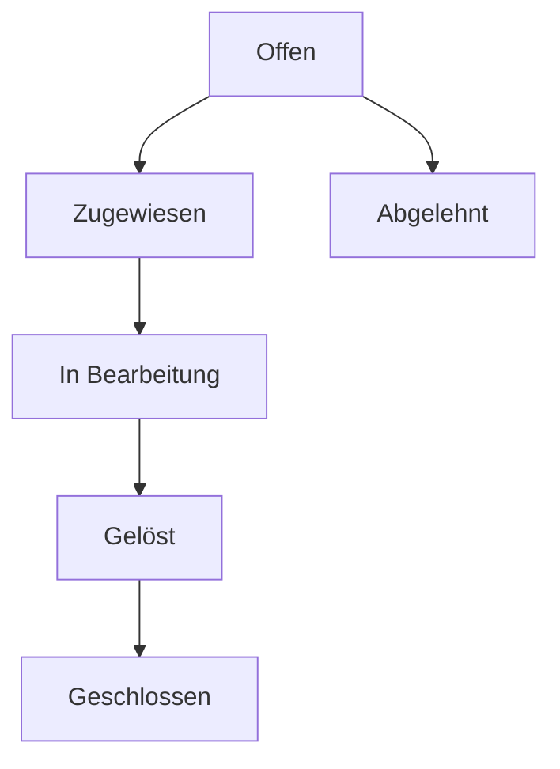

# 📖 Scandy Handbuch für Administratoren und Anwender

## Einführung

**Willkommen bei Scandy!** Dieses Handbuch führt Sie durch alle Aspekte der Verwaltung und Nutzung von Scandy, Ihrem modernen Werkzeug- und Verbrauchsmaterialverwaltungssystem.

### 🎯 Was ist Scandy?

Scandy ist eine webbasierte Anwendung zur **Verwaltung von Werkzeugen, Verbrauchsmaterialien und Aufgaben** in Unternehmen. Sie unterstützt:

- **Barcode-basierte Identifikation** für schnelle Erfassung
- **Rollenbasierte Zugriffskontrolle** (Administrator, Mitarbeiter, Anwender, Teilnehmer)
- **Automatische Bestandsverfolgung** und Warnungen
- **Ticket-System** für Aufgaben und Kommunikation
- **Mobile Optimierung** für Touch-Geräte

### 📋 Zielgruppe dieses Handbuchs

- **Administratoren**: Technische Einrichtung, Konfiguration, Wartung
- **Mitarbeiter**: Werkzeug- und Materialverwaltung, Ticket-Bearbeitung
- **Anwender**: Grundlegende Nutzung, Berichterstattung
- **Teilnehmer**: Wochenberichte, einfache Ticket-Erstellung

---

## 🚀 Schnellstart für Administratoren

### Systemvoraussetzungen

**Minimal-Anforderungen:**
- Ubuntu/Debian Linux 22.04+
- 2 CPU-Kerne, 2 GB RAM, 5 GB Speicher
- Root-Zugriff für Installation

**Empfohlene Konfiguration:**
- Ubuntu 22.04+ oder neuer
- 4 CPU-Kerne, 4 GB RAM, 10 GB SSD
- Docker & Docker Compose (optional)

### Installation

```bash
# 1. Repository klonen
git clone <repository-url> scandy
cd scandy

# 2. Ausführbar machen
chmod +x install_scandy_simple_new.sh

# 3. Installation starten (als root)
sudo ./install_scandy_simple_new.sh
```

**Nach der Installation:**
- Scandy läuft auf: `http://localhost/` (Port 80)
- MongoDB läuft auf: `localhost:27017`
- Mongo Express: `http://localhost:8081`

### Erste Konfiguration

1. **Browser öffnen**: `http://localhost/`
2. **Setup-Assistent** durchlaufen
3. **Admin-Benutzer** erstellen:
   - Benutzername: admin (oder frei wählbar)
   - E-Mail-Adresse: admin@ihre-domain.com
   - Starkes Passwort: Mindestens 8 Zeichen
4. **System konfigurieren**:
   - Firmenname eingeben
   - Abteilungen anlegen
   - Kategorien definieren

---

## 👑 Administrator-Handbuch

### 🔐 Anmeldung und Übersicht

Nach der Installation melden Sie sich mit Ihrem Admin-Konto an:

1. **URL**: `http://localhost/auth/login`
2. **Benutzername**: Ihr Admin-Benutzername
3. **Passwort**: Ihr Admin-Passwort

**Admin-Dashboard** zeigt Ihnen:
- 📊 **Systemübersicht**: Aktive Nutzer, offene Tickets
- 🔧 **Werkzeugstatus**: Verfügbar/Ausgeliehen/Defekt
- 📦 **Materialbestand**: Kritische Warnungen
- 🎫 **Ticket-Statistik**: Offen/In Bearbeitung/Gelöst

### 👥 Benutzerverwaltung

#### Neue Benutzer anlegen

1. **Navigation**: Admin → "Benutzerverwaltung" → "Neu"
2. **Pflichtfelder ausfüllen**:
   - **Benutzername**: Eindeutig, alphanumerisch
   - **E-Mail**: Gültige E-Mail-Adresse
   - **Vorname/Nachname**: Vollständiger Name
   - **Rolle**: Admin/Mitarbeiter/Anwender/Teilnehmer
3. **Optionale Felder**:
   - **Abteilung**: Für Sichtbarkeit einschränken
   - **Telefon**: Kontaktinformation
   - **Notizen**: Zusätzliche Informationen

#### Rollen und Berechtigungen

| Rolle | Werkzeuge | Material | Tickets | Admin-Bereich | Abteilung |
|-------|-----------|----------|---------|---------------|-----------|
| **Admin** | Vollzugriff | Vollzugriff | Vollzugriff | Vollzugriff | Alle |
| **Mitarbeiter** | Verwalten | Verwalten | Zuweisen/Bearbeiten | Eingeschränkt | Eigene |
| **Anwender** | Einsehen | Einsehen | Erstellen/Bearbeiten | Nein | Eigene |
| **Teilnehmer** | Einsehen | Nein | Erstellen | Nein | Eigene |

#### Massenimport von Benutzern

Erstellen Sie eine Excel-Datei mit folgenden Spalten:
```
username, email, role, department, firstname, lastname, phone
```

Beispiel:
```
max.mustermann, max@company.com, mitarbeiter, werkstatt, Max, Mustermann, 0123-456789
anna.schmidt, anna@company.com, anwender, verwaltung, Anna, Schmidt, 0123-987654
```

### ⚙️ Systemeinstellungen

#### Grundkonfiguration

**Admin → System → Einstellungen**

- **Systemname**: Name Ihrer Organisation
- **Beschreibung**: Kurze Beschreibung
- **Logo**: Hochladen (max. 5 MB, JPG/PNG)
- **Farbschema**: Standard/Dunkelmodus
- **Sprache**: Deutsch (aktuell)

#### Feature-Management

```yaml
# Aktivierbare Features
Wochenberichte: Aktiviert/Deaktiviert
Job-Börse: Aktiviert/Deaktiviert
Ticket-System: Aktiviert/Deaktiviert
Kantinen-Integration: Aktiviert/Deaktiviert
```

#### Abteilungsverwaltung

1. **Abteilung erstellen**: Admin → "Abteilungen" → "Neu"
2. **Name**: Eindeutiger Abteilungsname
3. **Beschreibung**: Zweck der Abteilung
4. **Verantwortlicher**: Admin-Benutzer zuweisen

**Abteilungsfunktion:**
- Datenisolierung zwischen Abteilungen
- Admin sieht alle Abteilungen
- Mitarbeiter sehen nur eigene Abteilung
- Berechtigungen sind abteilungsspezifisch

### 🔧 Werkzeugverwaltung (Admin)

#### Neue Werkzeuge anlegen

1. **Admin → Werkzeuge → Neu**
2. **Barcode generieren**:
   - Automatisch: System erstellt eindeutigen Code
   - Manuell: Eigener Barcode eingeben
3. **Details eingeben**:
   - **Name**: Bezeichnung des Werkzeugs
   - **Beschreibung**: Detaillierte Beschreibung
   - **Kategorie**: Werkzeugtyp (z.B. Handwerkzeug, Maschine)
   - **Standort**: Lagerort oder Raum
   - **Anschaffungspreis**: Optional für Kalkulation
   - **Wartungsintervall**: Monate zwischen Wartungen

#### Werkzeug-Kategorien

**Empfohlene Kategorien:**
- 🔧 **Handwerkzeuge**: Schraubendreher, Zangen, Hämmer
- ⚙️ **Maschinen**: Bohrmaschinen, Sägen, Schleifer
- 📏 **Messwerkzeuge**: Wasserwaagen, Maßbänder, Laser
- 🛠️ **Spezialwerkzeuge**: Spezifische Geräte
- 🏗️ **Baustellenmaterial**: Temporäre Werkzeuge

#### Barcode-System

**Barcode-Formate unterstützt:**
- Code 128 (Standard)
- QR-Code (für komplexe Daten)
- EAN-13 (für standardisierte Produkte)

**Barcode-Generierung:**
- Automatisch bei Neuanlage
- Druckbare Etiketten über Detailansicht
- Mobile Erfassung per Kamera

### 📦 Verbrauchsmaterialien (Admin)

#### Material anlegen

1. **Admin → Verbrauchsmaterial → Neu**
2. **Grunddaten**:
   - **Name**: Materialbezeichnung
   - **Beschreibung**: Detaillierte Informationen
   - **Einheit**: Stück, Liter, kg, m², etc.
   - **Lieferant**: Optional für Nachbestellung

3. **Bestandsverwaltung**:
   - **Mindestbestand**: Warnschwelle
   - **Aktueller Bestand**: Anfangsinventur
   - **Lagerort**: Standort im Lager

#### Bestandsanpassungen

**Bestand erhöhen (Wareneingang):**
- Material auswählen
- "Bestand anpassen" → Positiver Wert
- Grund angeben (z.B. "Wareneingang vom 15.01.")

**Bestand reduzieren (Verbrauch):**
- Material auswählen
- "Bestand anpassen" → Negativer Wert
- Grund angeben (z.B. "Verbrauch Projekt XY")

#### Automatische Warnungen

**Konfiguration:**
- Mindestbestand erreicht: E-Mail an zuständige Mitarbeiter
- Bestand = 0: Dringende Warnung an Admin
- Prognosen: Basierend auf letzten 30 Tagen

### 🎫 Ticket-System (Admin)

#### Ticket-Kategorien

**Vordefinierte Kategorien:**
- 📋 **Allgemein**: Verschiedene Anfragen
- 🔧 **Werkzeug-Reparatur**: Defekte Werkzeuge
- 📦 **Material-Bestellung**: Nachbestellungen
- 💼 **Auftrag**: Spezifische Arbeitsaufträge
- ❓ **Sonstiges**: Nicht kategorisierbare Anfragen

#### Ticket-Workflow



**Status-Übergänge:**
- **Offen → Zugewiesen**: Verantwortlichen zuweisen
- **Zugewiesen → In Bearbeitung**: Arbeit begonnen
- **In Bearbeitung → Gelöst**: Problem behoben
- **Gelöst → Geschlossen**: Nach 7 Tagen automatisch

#### Ticket-Verwaltung

**Neues Ticket erstellen:**
1. **Tickets → Neu**
2. **Typ wählen**: Allgemein/Auftrag/Materialbedarf
3. **Priorität setzen**: Niedrig/Normal/Hoch/Kritisch
4. **Beschreibung**: Detaillierte Problembeschreibung
5. **Anhänge**: Bilder, Dokumente hinzufügen

**Ticket zuweisen:**
- Zuständigen Mitarbeiter auswählen
- Abteilung automatisch zuweisen
- Kommentar zur Zuweisung hinzufügen

### 💾 Backup & Wiederherstellung

#### Automatische Backups

**Standard-Konfiguration:**
- **Täglich**: 02:00 Uhr
- **Wöchentlich**: Sonntags 03:00 Uhr
- **Monatlich**: Erster des Monats 04:00 Uhr

**Aufbewahrungszeiten:**
- Tägliche Backups: 7 Tage
- Wöchentliche Backups: 4 Wochen
- Monatliche Backups: 12 Monate

#### Manuelle Backups

1. **Admin → Backup → "Backup erstellen"**
2. **Name vergeben** (z.B. "Backup_vor_Update_2024")
3. **Bestätigen** - System erstellt Backup im Hintergrund
4. **Download**: Nach Fertigstellung herunterladen

#### Wiederherstellung

**Vorsicht:** Wiederherstellung überschreibt alle aktuellen Daten!

1. **Admin → Backup → Sicherung auswählen**
2. **"Wiederherstellen" klicken**
3. **Bestätigen** - System erstellt automatisch Sicherung vor Restore
4. **Warten** - Prozess kann mehrere Minuten dauern

### 📊 Berichte & Exporte

#### Verfügbare Berichte

**Werkzeug-Berichte:**
- Inventar-Liste (Excel/PDF)
- Ausleih-Historie
- Wartungsübersicht
- Kosten-Nachweis

**Material-Berichte:**
- Bestandsübersicht
- Verbrauchsstatistik
- Nachbestell-Liste

**Ticket-Berichte:**
- Offene Tickets
- Bearbeitungszeiten
- Kategorien-Statistik
- Mitarbeiter-Auslastung

#### Export-Formate

- **Excel (.xlsx)**: Für Tabellenkalkulation
- **PDF**: Für Archivierung und Druck
- **CSV**: Für Datenimport in andere Systeme

### 🔒 Sicherheit & Datenschutz

#### Passwort-Richtlinien

**Anforderungen:**
- Mindestlänge: 8 Zeichen
- Groß- und Kleinbuchstaben
- Zahlen und Sonderzeichen
- Keine Wörter aus Wörterbüchern

**Passwort-Reset:**
- E-Mail mit Reset-Link
- Gültigkeit: 24 Stunden
- Einmal-Verwendung

#### Zugriffsprotokollierung

**Protokollierte Aktionen:**
- Anmeldungen/Abmeldungen
- Datenänderungen
- Ticket-Änderungen
- Systemeinstellungen

**Aufbewahrung:**
- Protokolle: 90 Tage
- Archivierung: 2 Jahre
- Löschung: Nach 2 Jahren automatisch

### 📱 Mobile Optimierung

#### Touch-Geräte

**Unterstützte Geräte:**
- Tablets (Android/iOS)
- Touch-Monitore
- Smartphones (eingeschränkt)

**QuickScan-Funktion:**
- Barcode-Scan per Kamera
- Touch-optimierte Oberfläche
- Offline-Modus (geplant)

---

## 👤 Anwender-Handbuch

### 🔑 Erste Schritte für Anwender

#### Anmeldung

1. **URL aufrufen**: `http://localhost/auth/login`
2. **Benutzername/Passwort** eingeben
3. **"Anmelden" klicken**

**Passwort vergessen?**
- "Passwort vergessen?" klicken
- E-Mail-Adresse eingeben
- Reset-Link folgen

### 🏠 Dashboard-Übersicht

**Hauptbereiche:**
- 📊 **Kennzahlen**: Offene Tickets, ausgeliehene Werkzeuge
- ⚠️ **Warnungen**: Niedrige Materialbestände
- 📅 **Kalender**: Wartungstermine
- 🎫 **Meine Tickets**: Persönliche Aufgaben

### 🔧 Werkzeug-Nutzung

#### Werkzeuge finden

**Suchoptionen:**
- **Barcode-Scan**: Kamera für schnelle Suche
- **Textsuche**: Name oder Beschreibung
- **Kategorie-Filter**: Nach Werkzeugtyp filtern
- **Status-Filter**: Verfügbar/Ausgeliehen/Defekt

#### Werkzeug-Details

**Informationen:**
- 📋 **Beschreibung**: Detaillierte Informationen
- 📍 **Standort**: Wo das Werkzeug zu finden ist
- 🏷️ **Barcode**: Zum Scannen oder Drucken
- 📅 **Historie**: Bisherige Ausleihen
- 🔧 **Status**: Aktueller Zustand

#### Ausleihe anfordern

1. **Werkzeug auswählen**
2. **"Ausleihen" klicken**
3. **Zweck angeben** (optional)
4. **Bestätigen**

**Automatische Genehmigung:**
- Bei verfügbaren Werkzeugen
- Innerhalb der Abteilung
- Nach Berechtigung

### 📦 Verbrauchsmaterialien

#### Material-Übersicht

**Ansicht-Optionen:**
- **Alle Materialien**: Vollständige Liste
- **Kritische Bestände**: Nur Warnungen
- **Meine Abteilung**: Abteilungsspezifisch

#### Material-Details

**Informationen:**
- 📊 **Aktueller Bestand**: Verfügbare Menge
- 📉 **Mindestbestand**: Warnschwelle
- 📈 **Verbrauchsprognose**: Nächste 30 Tage
- 🏢 **Lagerort**: Standort im Lager

### 🎫 Ticket-System für Anwender

#### Neues Ticket erstellen

1. **Tickets → Neu**
2. **Kategorie wählen**:
   - 🔧 Werkzeug-Problem
   - 📦 Material-Bestellung
   - ❓ Sonstiges
3. **Priorität festlegen**:
   - 🟢 Niedrig (Informationszwecke)
   - 🟡 Normal (Bald bearbeiten)
   - 🔴 Hoch (Dringend)
   - ⚫ Kritisch (Sofort)
4. **Beschreibung schreiben**:
   - Detailliertes Problem beschreiben
   - Schritte zur Reproduktion
   - Erwartetes Ergebnis
5. **Anhänge hinzufügen**:
   - Bilder von Problemen
   - Dokumente oder Skizzen
   - Screenshots

#### Ticket-Status verfolgen

**Status-Indikatoren:**
- 🟢 **Offen**: Warten auf Zuweisung
- 🟡 **Zugewiesen**: Jemand arbeitet daran
- 🔵 **In Bearbeitung**: Aktive Lösung
- 🟣 **Gelöst**: Problem behoben
- ⚪ **Geschlossen**: Abgeschlossen

#### Kommunikation im Ticket

**Nachrichten schreiben:**
- Updates zum Problem
- Zusätzliche Informationen
- Feedback zur Lösung

**Anhänge hinzufügen:**
- Zusätzliche Bilder
- Dokumente
- Videos (bei Bedarf)

### 📊 Berichte & Exporte

#### Persönliche Berichte

**Verfügbare Berichte:**
- 📋 **Meine Ausleihen**: Werkzeug-Historie
- 🎫 **Meine Tickets**: Persönliche Aufgaben
- 📅 **Wochenberichte**: Arbeitsnachweise

#### Export-Optionen

**Formate:**
- 📄 **PDF**: Für Archivierung
- 📊 **Excel**: Für Weiterverarbeitung
- 🖨️ **Druck**: Direkter Druck

### 📱 Mobile Nutzung

#### Touch-Optimierung

**Vorteile:**
- 👆 **Touch-freundlich**: Große Schaltflächen
- 📱 **Responsive**: Passt sich Bildschirm an
- 🔍 **QuickScan**: Barcode per Kamera

#### QuickScan-Funktion

**Verwendung:**
1. **"QuickScan" öffnen**
2. **Barcode scannen** per Kamera
3. **Aktion wählen**:
   - Ausleihen
   - Zurückgeben
   - Details anzeigen

**Unterstützte Barcodes:**
- 📱 QR-Codes
- 📦 Code 128
- 🏷️ EAN-13

### 🔄 Wochenberichte (für Teilnehmer)

#### Bericht erstellen

1. **Wochenberichte → Neu**
2. **Zeitraum wählen** (Woche von/bis)
3. **Aktivitäten dokumentieren**:
   - Geleistete Arbeiten
   - Verwendete Werkzeuge
   - Verbrauchte Materialien
   - Besondere Vorkommnisse

#### Bericht-Inhalte

**Erforderliche Angaben:**
- 📅 **Datum/Uhrzeit**
- 🔧 **Tätigkeiten**: Was wurde gemacht
- ⏱️ **Dauer**: Zeitaufwand
- 📝 **Ergebnisse**: Erreichtes
- 💡 **Probleme**: Aufgetretene Schwierigkeiten

---

## 🆘 Fehlerbehebung

### Häufige Probleme

#### 🔐 Anmeldung nicht möglich

**Mögliche Ursachen:**
- Falsches Passwort
- Konto gesperrt (zu viele Fehlversuche)
- Browser-Cache leeren

**Lösungen:**
1. **Passwort zurücksetzen**
2. **Cache leeren** (Strg+F5)
3. **Anderen Browser** versuchen
4. **Admin kontaktieren**

#### 📱 Seite lädt nicht

**Fehlerbehebung:**
1. **Internetverbindung** prüfen
2. **Cache leeren** (Strg+F5)
3. **Hard Reload**: Strg+Shift+R
4. **Anderen Browser** testen

#### 🔧 Werkzeug nicht auffindbar

**Suchoptionen:**
1. **Barcode erneut scannen**
2. **Textsuche** verwenden
3. **Kategorie-Filter** anpassen
4. **Admin kontaktieren** (falls archiviert)

#### 📦 Falscher Materialbestand

**Korrektur:**
1. **Admin informieren**
2. **Inventur durchführen**
3. **Bestand manuell anpassen** (nur Admin)

### 📞 Support-Kontakt

#### Bei Problemen:

1. **Lokaler Admin** kontaktieren
2. **Ticket erstellen** im System
3. **Detaillierte Beschreibung** geben
4. **Screenshots** beifügen

#### Notfall-Kontakte:

- **Technischer Support**: admin@ihre-domain.com
- **System-Status**: `http://localhost/health`
- **Backup-Status**: Admin-Bereich prüfen

---

## 📋 Checkliste für Administratoren

### ⏰ Tägliche Aufgaben

- [ ] System-Status prüfen (`http://localhost/health`)
- [ ] Offene Tickets überprüfen
- [ ] Kritische Materialbestände checken
- [ ] Neue Benutzeranfragen bearbeiten
- [ ] Backup-Status verifizieren

### 📅 Wöchentliche Aufgaben

- [ ] Backup-Dateien überprüfen
- [ ] Benutzerkonten aktualisieren
- [ ] System-Updates durchführen
- [ ] Berichte erstellen und archivieren
- [ ] Festplatten-Speicher überwachen

### 📆 Monatliche Aufgaben

- [ ] Vollständiges Backup erstellen
- [ ] System-Performance analysieren
- [ ] Benutzerberechtigungen überprüfen
- [ ] Datenbank-Optimierung durchführen
- [ ] Sicherheits-Updates installieren

### 📊 Quartalsweise Aufgaben

- [ ] Komplette Inventur durchführen
- [ ] Benutzer-Training organisieren
- [ ] System-Dokumentation aktualisieren
- [ ] Backup-Strategie überprüfen

---

## 📋 Checkliste für Anwender

### 🔧 Tägliche Nutzung

- [ ] System anmelden
- [ ] Dashboard auf Warnungen prüfen
- [ ] Benötigte Werkzeuge/Materialien suchen
- [ ] Tickets aktualisieren
- [ ] Arbeitsende dokumentieren

### 📝 Wochenberichte

- [ ] Zeitraum korrekt auswählen
- [ ] Alle Tätigkeiten dokumentieren
- [ ] Verwendete Ressourcen angeben
- [ ] Probleme/Problemlösungen beschreiben
- [ ] Bericht fristgerecht abgeben

### 🔄 Monatliche Aufgaben

- [ ] Persönliche Berichte exportieren
- [ ] Arbeitszeiten überprüfen
- [ ] Offene Tickets abschließen
- [ ] Feedback an Admin geben

---

## 🎯 Best Practices

### Für Administratoren

#### System-Management
- **Regelmäßige Backups** erstellen
- **Benutzerberechtigungen** minimal vergeben
- **System-Updates** zeitnah durchführen
- **Monitoring** aktiv nutzen

#### Benutzerverwaltung
- **Klare Rollen** definieren
- **Regelmäßige Audits** durchführen
- **Schulungen** anbieten
- **Feedback** einholen

#### Sicherheit
- **Starke Passwörter** erzwingen
- **Zwei-Faktor-Authentifizierung** aktivieren
- **Protokolle** regelmäßig prüfen
- **Datenschutz** einhalten

### Für Anwender

#### Effiziente Nutzung
- **Suchfunktionen** nutzen
- **Barcodes** verwenden
- **Tickets** detailliert beschreiben
- **Berichte** regelmäßig führen

#### Zusammenarbeit
- **Kommunikation** im System führen
- **Anhänge** verwenden
- **Status** aktualisieren
- **Feedback** geben

---

## 📚 Glossar

### Häufig verwendete Begriffe

**Abteilung**: Organisatorische Einheit mit eigener Daten-Sichtbarkeit
**Admin**: Administrator mit vollen Systemberechtigungen
**Anwender**: Benutzer mit eingeschränkten Berechtigungen
**Barcode**: Maschinenlesbarer Code zur Identifikation
**Dashboard**: Übersichtsseite mit wichtigen Kennzahlen
**Mitarbeiter**: Benutzer mit Verwaltungsberechtigungen
**QuickScan**: Touch-optimierte Barcode-Scan-Funktion
**Rolle**: Berechtigungsset für Benutzer
**Teilnehmer**: Benutzer mit minimalen Berechtigungen
**Ticket**: Aufgaben- oder Problem-Meldung im System

---

## 🔗 Nützliche Links

### Interne Ressourcen
- **System-Status**: `http://localhost/health`
- **Mongo Express**: `http://localhost:8081`
- **API-Dokumentation**: `http://localhost/api/docs`

### Externe Ressourcen
- **Flask-Dokumentation**: https://flask.palletsprojects.com/
- **MongoDB-Handbuch**: https://docs.mongodb.com/
- **Tailwind CSS**: https://tailwindcss.com/

---

## 📞 Support & Kontakt

### Technischer Support
- **E-Mail**: support@scandy.local
- **Ticket-System**: Innerhalb der Anwendung
- **Telefon**: Nach Vereinbarung

### Feedback & Verbesserungen
- **Feature-Requests**: Über Ticket-System
- **Bug-Reports**: Mit detaillierten Schritten
- **Verbesserungsvorschläge**: Admin kontaktieren

---

*Dieses Handbuch wird regelmäßig aktualisiert. Bei Fragen oder Unklarheiten wenden Sie sich bitte an Ihren Administrator.*

**Version:** 1.0 | **Datum:** $(date +%Y-%m-%d) | **Scandy-Version:** Beta 0.8.1
